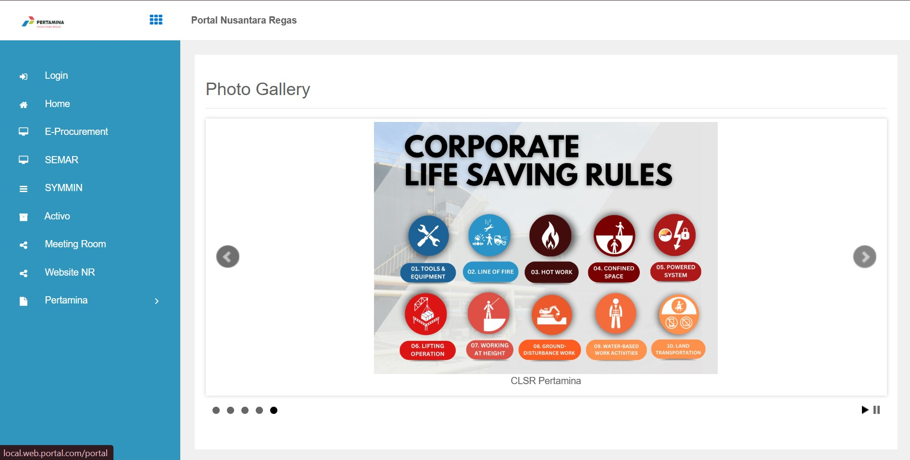
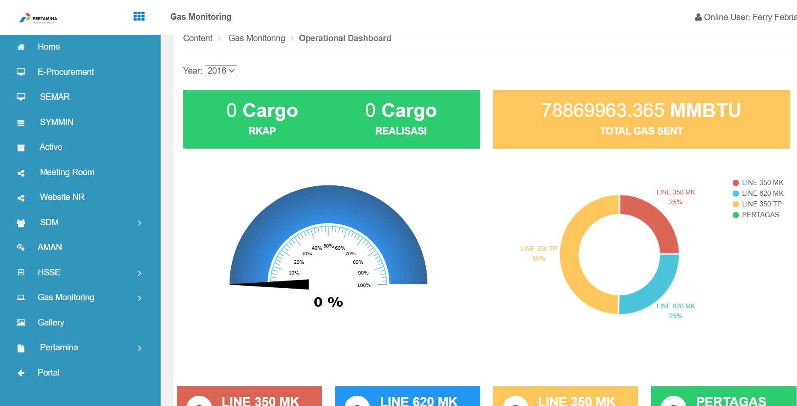
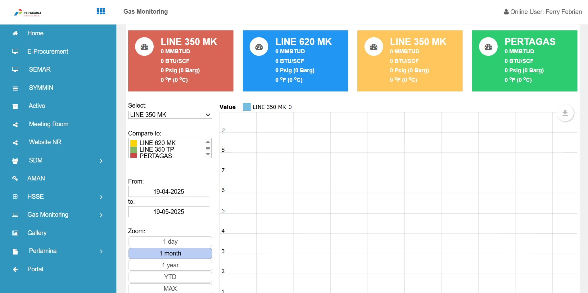

# Portal Gas

## Description

Portal Gas is a comprehensive web application designed for gas operations management, built with ASP.NET Core 8.0 and modern web technologies. This project provides a robust foundation for managing various aspects of gas operations and related business functions.

## Key Technologies

- **ASP.NET Core 8.0**: Provides high-performance, cross-platform web application framework
- **Entity Framework Core 9.0**: Enables efficient database operations and migrations
- **SQL Server**: Primary database for storing application data
- **Identity Framework**: Handles user authentication and authorization
- **MailKit**: Manages email communications within the application
- **Swagger**: API documentation and testing interface

## Features

### Core Modules
1. **User Management**
   - Role-based access control
   - User profile management
   - Enterprise authentication integration

2. **Work Overtime Management**
   - Overtime request submission
   - Approval workflows
   - Overtime tracking and reporting

3. **Document Management**
   - Secure file storage
   - Version control
   - Document sharing and collaboration

4. **Gas Monitoring**
   - Real-time gas level monitoring
   - Alert system
   - Historical data tracking

5. **Safety Management**
   - Job Safety Analysis (JSA)
   - Risk assessment
   - Incident reporting
   - Daily check-up management

## Screenshots


*Main Dashboard Interface*


*Gas Monitoring Module*


*Safety Management Interface*

## Setup Guide

### Prerequisites

1. **Development Environment**
   - Visual Studio 2022 or later
   - .NET 8.0 SDK
   - SQL Server 2019 or later
   - Git

2. **Required Software**
   - Node.js (for frontend dependencies)
   - SQL Server Management Studio (recommended)

### Installation Steps

1. **Clone and Setup**
   ```bash
   git clone <your-repository-url>
   cd portal-gas
   ```

2. **Database Setup**
   - Open SQL Server Management Studio
   - Create a new database named "PortalGas"
   - Navigate to the `Migration` folder
   - Execute the SQL scripts in the following order:
     1. `01_CreateTables.sql`
     2. `02_SeedData.sql`

3. **Configuration**
   - Copy `appsettings.Example.json` to `appsettings.json`
   - Update the following settings:
     ```json
     {
       "ConnectionStrings": {
         "DefaultConnection": "Server=YOUR_SERVER;Database=PortalGas;Trusted_Connection=True;"
       },
       "EmailSettings": {
         "SmtpServer": "YOUR_SMTP_SERVER",
         "Port": 587,
         "Username": "YOUR_EMAIL",
         "Password": "YOUR_PASSWORD"
       }
     }
     ```

4. **Build and Run**
   ```bash
   dotnet restore
   dotnet build
   dotnet run
   ```

5. **Access the Application**
   - Open your browser and navigate to `https://localhost:5001`
   - Default admin credentials:
     - Username: admin@portal.com
     - Password: Admin@123

## Security and Sensitive Data Handling

### 1. Configuration Files
- Never commit sensitive configuration files to version control
- Always use `appsettings.Example.json` as a template
- Add the following to `.gitignore`:
  ```
  appsettings.json
  appsettings.*.json
  !appsettings.Example.json
  *.pfx
  *.key
  *.pem
  *.cert
  ```

### 2. Database Security
- Use strong passwords for database accounts
- Implement connection string encryption
- Regularly backup database
- Use parameterized queries to prevent SQL injection
- Implement proper database user permissions
- Consider using Azure Key Vault or similar for secrets management

### 3. Authentication & Authorization
- Change all default passwords immediately
- Implement password complexity requirements
- Enable two-factor authentication
- Use secure session management
- Implement proper role-based access control
- Regular security audits of user permissions

### 4. API Security
- Use HTTPS for all API endpoints
- Implement proper API authentication
- Use API keys or OAuth2 for external access
- Rate limiting to prevent abuse
- Input validation and sanitization
- CORS policy configuration

### 5. File Security
- Secure file upload validation
- Scan uploaded files for malware
- Implement proper file access permissions
- Use secure file storage locations
- Regular cleanup of temporary files

### 6. Logging and Monitoring
- Implement secure logging practices
- Don't log sensitive information
- Use proper log rotation
- Monitor for suspicious activities
- Regular security log reviews

### 7. Email Security
- Use secure SMTP settings
- Implement email encryption
- Don't include sensitive data in emails
- Use proper email templates
- Implement email verification

### 8. Development Practices
- Regular security updates
- Code security reviews
- Dependency vulnerability scanning
- Secure coding guidelines
- Regular penetration testing

## Support and Contact

For support or inquiries, please contact:
- Email: revanza.raytama@gmail.com
- LinkedIn: [linkedin.com/in/revanzaraytama](https://linkedin.com/in/
revanzaraytama)

## License

This project is licensed under the MIT License. See the [LICENSE](LICENSE) file for details.

## Contributing

1. Fork the repository
2. Create a feature branch
3. Commit your changes
4. Push to the branch
5. Create a Pull Request

## Project Status

This project is actively maintained. For bug reports or feature requests, please open an issue on the repository.
